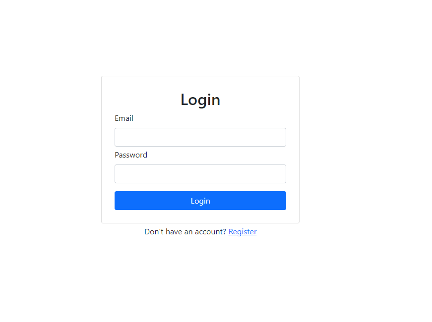
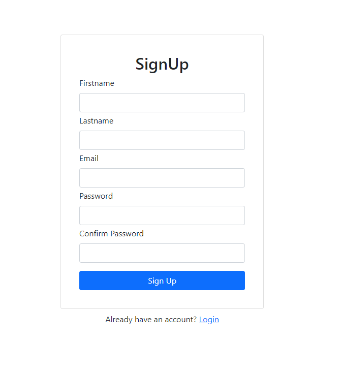
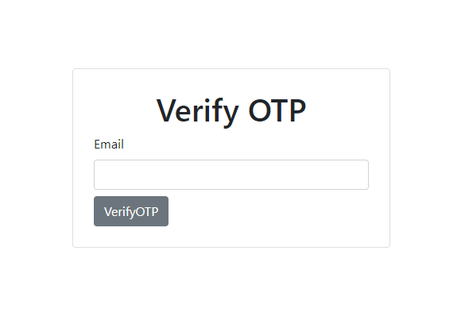
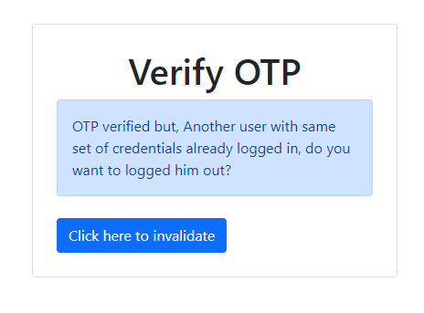
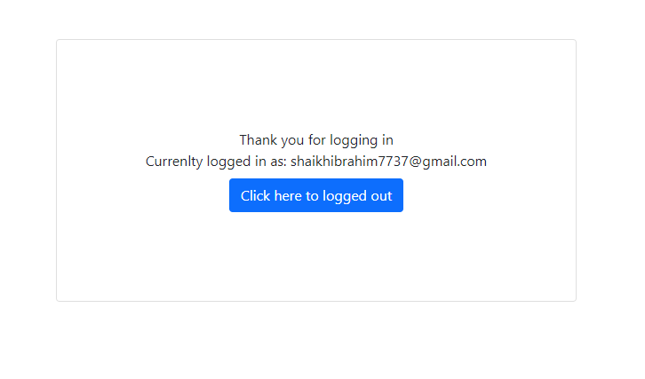
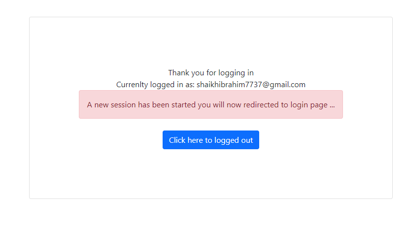

# Wisestep Assignment

**How to test the application**

Go to below URL to access the application

`http://15.207.74.104/`

**Features**
1. Login.
2. Registration.
3. 2-Factor Authentication with Email.
4. Single Session of user.

**Tech Stack Used**
1. Spring Boot (Backend)
2. React JS (Frontend)
3. Redis 
4. MongoDB 
5. AWS (Hosting)

**Want to deploy the application?**

If you want to run this application on your machine then go to Devops folder.

**Versions**

There is 2 version of this application 1st is whose database is MongoDB and another is MYSQL, MongoDB is in Master branch and Mysql is in mysql branch, right now you are seeing master branach.

**Below are the snippets of application**

**Login Screen**

**SignUp Screen**

**OTP Verification**

**Invalidate Session**

**LoggedIN Screen**

**After session invalidate in LoggedIn screen**

